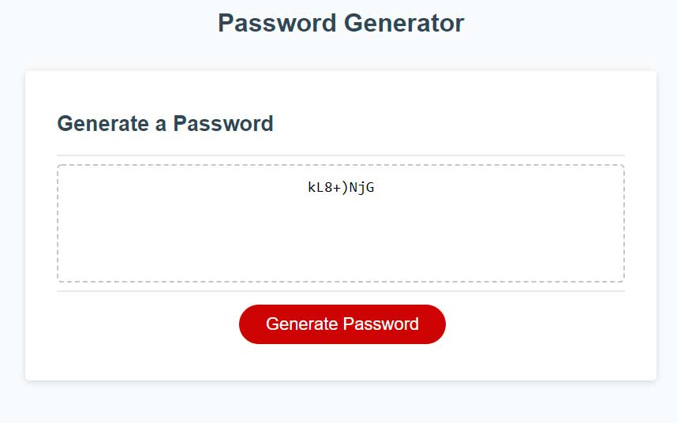

# challenge-03
JavaScript Challenge: Password Generator

Following the acceptance criteria order, the password generator raises a series of prompts:
1) "Enter password length within the range of 8 - 128 characters."
2) "Include lowercase?"
3) "Include uppercase?"
4) "Include numerals?"
5) "Include special characters?"

After specifying allowed length & character types, a password is randomly generated. If the user does not satisifactorily answer prompts, a password will not be generated.

Javascript reads logically (Character Arrays, generateBtn, criteria prompts, password generation, text display of said generation, event listener) with psuedocode commentary headlining the real code.

Live URL
https://escowin.github.io/challenge-03/

GitHub Repository
https://github.com/escowin/challenge-03

<!-- ACCEPTANCE CRITERIA:
    GIVEN I need a new, secure password 
    WHEN I click the button to generate a password
    THEN I am presented with a series of prompts for password criteria

    WHEN prompted for password criteria
    THEN I select which criteria to include in the password

    WHEN prompted for the length of the password
    THEN I choose a length of at least 8 characters and no more than 128 characters

    WHEN asked for character types to include in the password
    THEN I confirm whether or not to include lowercase, uppercase, numeric, and/or special characters

    WHEN I answer each prompt
    THEN my input should be validated and at least one character type should be selected

    WHEN all prompts are answered
    THEN a password is generated that matches the selected criteria

    WHEN the password is generated
    THEN the password is either displayed in an alert or written to the page -->