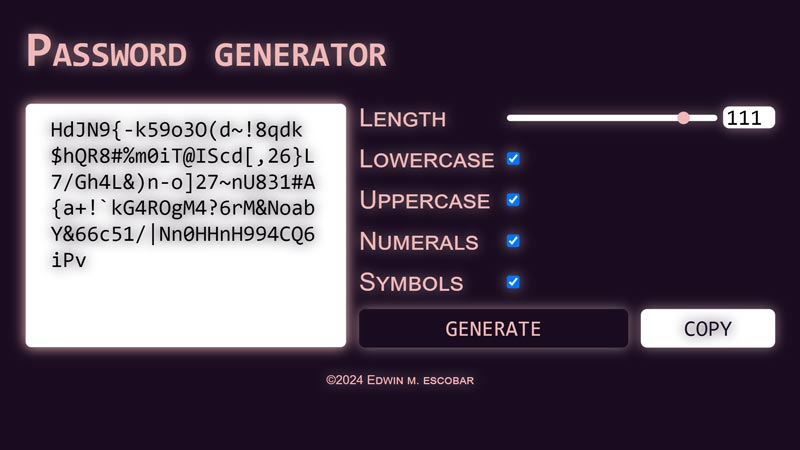

# password-generator

## Description
### [Repo](https://github.com/escowin/password-generator)
### [Live URL](https://escowin.github.io/password-generator)
    
pwa that generates randomized passwords through user-selected parameters

## Table of Contents
- [Installation](#installation)
- [Test](#test)
- [Usage](#usage)
- [Features](#features)
- [Credits](#credits)
- [Author](#author)

## Installation
### Local machine
Run the following command to install necessary dependencies:
```
$ npm i
```
### Browser via [live URL](https://escowin.github.io/password-generator)
- Desktop : click install icon in address bar.
- iOS: click 'Add to Home Screen'.

## Test
Run the following command to run tests:
```
$ npm run test
```

## Usage
Run the following command to run app:
```
$ npm run start:dev
```



## Features
- Customizable password generation
- Copy passwords to clipboard
- Offline functionality
- PWA Optimization


## Credits
- Languages: HTML, CSS, JavaScript
- Frameworks: [Node](https://nodejs.org/)
- Libraries: [webpack](https://webpack.js.org/), [Clipboard API](https://developer.mozilla.org/en-US/docs/Web/API/Clipboard_API)

## Author
### edwin escobar
- [Email](mailto:edwin@escowinart.com)
- [GitHub](https://github.com/escowin)
